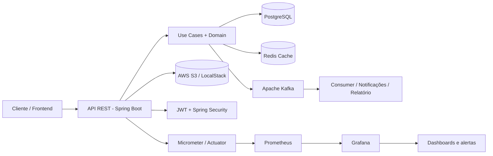

# Financial Hub

Plataforma bancária moderna para gestão de usuários, contas, transferências e eventos financeiros, construída com Java, Spring Boot, PostgreSQL, Kafka, Redis e infraestrutura em Docker/Kubernetes. O projeto segue uma arquitetura de software orientada a regras de negócio e é guiado por especificações em [specs/](specs/), com foco em consistência financeira, segurança e observabilidade.

## Como rodar

Na raiz do repositório (`docker-compose.yml`):

```bash
docker compose up --build -d
```

Parar:

```bash
docker compose down
```

Limpar este projeto (containers, volumes e imagens do Compose):

```bash
docker compose --profile oracle --profile sonar --profile jobs down -v --rmi all
```

Limpar o Docker inteiro da máquina (todos os containers, imagens, volumes e cache):

```bash
docker system prune -af --volumes
```

Opcionais (imagens grandes):

```bash
docker compose --profile oracle up --build -d   # Oracle + notification :8081
docker compose --profile sonar up --build -d    # SonarQube :9000
docker compose --profile jobs up --build -d     # job Python
```

Latência simulada (laboratório, não altera saldo):

```bash
SIMULATED_LATENCY_MS=800 docker compose up -d --force-recreate app
```

Angular: http://localhost:4200 · Next.js: http://localhost:3000 · API: http://localhost:8080

## Visão geral

O Financial Hub simula um ecossistema financeiro com as preocupações de um sistema bancário real:

- autenticação e autorização por JWT
- gestão de clientes e documentos
- saldo e histórico de movimentações
- transferências com validações e idempotência
- processamento assíncrono por eventos Kafka
- cache distribuído em Redis
- integração com AWS S3 via LocalStack
- monitoramento com Prometheus e Grafana
- visualização e análise de logs estruturados

A solução foi pensada como um MVP robusto para demonstrar como uma aplicação bancária moderna lida com consistência, desacoplamento, segurança e observabilidade em ambiente de desenvolvimento e homologação.

## Objetivos do projeto

- Garantir consistência do saldo em PostgreSQL
- Permitir operações financeiras com regras explícitas de negócio
- Validar identidade e autorização do usuário com JWT e BCrypt
- Desacoplar processamentos colaterais via Kafka
- Melhorar desempenho de leitura com Redis
- Aplicar padrões de arquitetura limpa e contratos de API bem definidos
- Demonstrar capacidade de operação em containers, Kubernetes e infraestrutura como código

## Arquitetura



### Camadas principais

- Domain: entidades, regras e contratos centrais
- Application: casos de uso e port adapters
- Infrastructure: JPA, segurança, Kafka, Redis, S3, JWT
- Interfaces: controllers REST e DTOs
- External integrations: Kafka, Redis, S3, LocalStack, Oracle notification-service

## Stack tecnológica

### Backend

| Área | Tecnologia |
|------|------------|
| Linguagem | Java 17 |
| Build | Maven |
| Framework | Spring Boot 3.2.5 |
| Segurança | Spring Security, JWT, BCrypt |
| Persistência | PostgreSQL 16, Spring Data JPA, Flyway |
| Cache | Redis |
| Mensageria | Apache Kafka |
| Arquitetura | Clean Architecture / Hexagonal |
| Documentação de API | OpenAPI / Swagger |
| Observabilidade | Micrometer, Actuator, Prometheus, Grafana, Zipkin |
| Logs | Logback + Logstash JSON encoder |
| Resiliência | Resilience4j, Bucket4j |
| Cloud local | AWS S3 via LocalStack |
| Testes | JUnit 5, Mockito, Testcontainers |

### Frontend

| Interface | Pasta | URL |
|-----------|-------|-----|
| Angular | `frontend/angular/` | http://localhost:4200 |
| Next.js / React | `frontend/next/` | http://localhost:3000 |
| Mobile Expo | `frontend/mobile/` | Expo Go / simulador |

### Microsserviço complementar

| Serviço | Descrição |
|---------|-----------|
| notification-service | serviço dedicado para inbox de notificações, consumindo eventos Kafka e persistindo em Oracle |

### Infraestrutura

| Tecnologia | Uso |
|------------|-----|
| Docker Compose | ambiente local |
| Kubernetes | orquestração e health probes |
| Helm | deploy de aplicações em cluster |
| Terraform | provisionamento de recursos AWS / LocalStack |
| GitHub Actions | CI/CD |
| SonarQube | qualidade de código |

## Funcionalidades implementadas

### Segurança e autenticação

- autenticação por CPF/CNPJ
- geração de access token e refresh token JWT
- proteção de endpoints por Spring Security
- senha armazenada com BCrypt
- CORS configurado para aplicações frontend locais
- validação de autorização por documento autenticado

### Gestão de usuários

- cadastro de cliente
- consulta por documento
- consulta de saldo
- histórico de movimentações
- extrato em PDF
- favoritos para recebedores

### Transferências financeiras

- validação de saldo disponível
- bloqueio pessimista com lock de banco
- idempotência por chave de operação
- processamento de eventos pós-transferência
- compensação e rastreabilidade por transações

### Mensageria e eventos

- publicação de eventos de transações em Kafka
- consumidores para notificação e relatórios
- DLQ para eventos que falham
- processamento idempotente para evitar duplicidade

### Cache e desempenho

- Redis como camada de cache para leitura de saldo
- TTL configurado para reduzir consultas repetitivas ao banco
- estratégia cache-aside para otimizar acesso e reduzir carga no PostgreSQL

### Observabilidade e monitoramento

- endpoints do Actuator expostos para health, info e métricas
- Prometheus como coletor de métricas
- Grafana com dashboards provisionados
- Zipkin para tracing distribuído
- logs em JSON para análise estruturada de eventos e correlação por traceId/spanId

## Exemplos de endpoints

| Método | Endpoint | Descrição |
|--------|----------|-----------|
| POST | /api/v1/users | criação de usuário |
| POST | /api/v1/auth/login | autenticação e retorno do JWT |
| GET | /api/v1/users/{document} | consulta de usuário |
| GET | /api/v1/users/{document}/balance | saldo por documento |
| GET | /api/v1/users/{document}/transactions | extrato |
| GET | /api/v1/users/{document}/transactions/export | exporta PDF do extrato |
| POST | /api/v1/transactions | criação de transferência |
| GET | /api/v1/transactions/{id} | consulta de status |

## Fluxo funcional principal

1. Usuário faz login com CPF/CNPJ e senha.
2. O backend valida as credenciais com BCrypt e oferece token JWT.
3. A API exige autenticação em endpoints sensíveis.
4. O cliente consulta saldo ou realiza transferência informando a senha da conta.
5. O sistema valida regras de negócio no banco.
6. A transação é registrada no PostgreSQL como fonte da verdade.
7. Eventos de negócio são emitidos em Kafka para consumidores secundários.
8. O Redis atualiza ou invalida cache de saldo.
9. Notificações e relatórios são processados de forma assíncrona.

## Observabilidade no ambiente local

Os serviços de monitoramento sobem no Compose padrão:

| Serviço | URL |
|---------|-----|
| Prometheus | http://localhost:9090 |
| Grafana | http://localhost:3001 |
| Zipkin | http://localhost:9411 |
| Spring Actuator | http://localhost:8080/actuator |
| Prometheus metrics | http://localhost:8080/actuator/prometheus |
| Health | http://localhost:8080/actuator/health |

### Métricas monitoradas

- requisições HTTP
- latência por endpoint
- status de resposta
- uso de memória JVM
- CPU e GC
- conexões HikariCP
- métricas Kafka
- health checks da aplicação

## Logs e análise

Os logs da aplicação são emitidos em formato JSON por Logback, com campos estruturados e suporte a rastreio por traceId e spanId. Isso permite correlação entre:

- requests HTTP
- operações no banco
- processamento Kafka
- eventos de negócio
- integração com serviços externos

A prática de logs estruturados facilita análise em ferramentas de observabilidade e investigação de incidentes.

## Segurança

A aplicação adota uma abordagem moderna de segurança para serviços financeiros:

- autenticação via JWT
- autenticação stateless
- senha protegida por BCrypt
- endpoints públicos somente para cadastro e login
- endpoints financeiros protegidos por autenticação
- CORS restrito a origens autorizadas
- rate limiting e segurança na camada de integração

## Infraestrutura e deploy

### Local (Docker)

Sobe backend, frontends e infra (Postgres, Redis, Kafka, Mongo, LocalStack, Prometheus, Grafana, Zipkin). Oracle/notification e SonarQube são profiles:

```bash
docker compose up --build -d
```

| Serviço | URL |
|---------|-----|
| Angular | http://localhost:4200 |
| Next.js / React | http://localhost:3000 |
| API | http://localhost:8080 |
| Swagger | http://localhost:8080/swagger-ui.html |
| notification-service | http://localhost:8081 (`--profile oracle`) |
| Grafana | http://localhost:3001 |
| Prometheus | http://localhost:9090 |
| Zipkin | http://localhost:9411 |
| SonarQube | http://localhost:9000 (`--profile sonar`) |
| LocalStack | http://localhost:4566 |

Profiles extras:

```bash
docker compose --profile oracle up --build -d
docker compose --profile sonar up --build -d
docker compose --profile jobs up --build -d
```

Dev das UIs sem container (se a API já estiver no Docker):

```bash
cd frontend/angular && npm install && npm start
cd frontend/next && npm install && npm run dev
cd frontend/mobile && npm install && npx expo start
```

### Kubernetes

A estrutura inclui manifests e Helm para deployment em cluster, com health probes e HPA.

### Terraform

A solução inclui provisionamento de recursos AWS e LocalStack, com foco em:

- PostgreSQL em RDS
- S3 para artefatos e comprovantes
- IAM e políticas
- infraestrutura reproduzível

## Estrutura do repositório

```text
financial/
├── AGENTS.md
├── README.md
├── DESAFIO.MD
├── backend/
│   ├── docker/
│   ├── docs/
│   ├── k8s/
│   ├── src/
│   ├── terraform/
│   ├── pom.xml
│   └── README.md
├── frontend/
│   ├── angular/
│   └── next/
├── services/
│   └── notification-service/
├── jobs/
│   └── daily-report/
├── infra/
│   ├── k8s/
│   ├── sonar/
│   └── terraform/
├── specs/
└── .github/
```

## Repositório de especificações

O projeto usa Spec-Driven Development e mantém as regras de negócio e arquitetura em [specs/](specs/). Isso garante alinhamento entre escopo, implementação e documentação.

## Testes e qualidade

```bash
cd backend && mvn test
cd services/notification-service && mvn test
```

A base de testes inclui:

- testes unitários com JUnit e Mockito
- testes de integração com Testcontainers
- cobertura com JaCoCo
- análise estática com SonarQube

## Roadmap de evolução

As próximas evoluções do projeto incluem:

- ElastiCache para cache distribuído em cloud
- SQS para mensageria alternativa
- MSK para Kafka gerenciado em AWS
- Lambda para processamentos leves e reativos
- Secrets Manager para segredos
- CloudWatch para observabilidade nativa
- Load Balancer e escalabilidade horizontal
- pipeline CI/CD mais robusto
- observabilidade centralizada e alertas automáticos

## Conclusão

O Financial Hub é uma solução de referência para demonstração de arquitetura moderna de sistemas bancários em Java, com foco em:

- consistência financeira
- integração assíncrona
- segurança de APIs
- alta disponibilidade em container
- qualidade de operação e observabilidade

Ele reúne práticas relevantes para o desenvolvimento de aplicações financeiras modernas, indo além do simples CRUD e demonstrando elementos reais de engenharia de software em escala.

## Documentação complementar

- [backend/README.md](backend/README.md)
- [frontend/README.md](frontend/README.md)
- [specs/README.md](specs/README.md)
- [AGENTS.md](AGENTS.md)
- [DESAFIO.MD](DESAFIO.MD)
