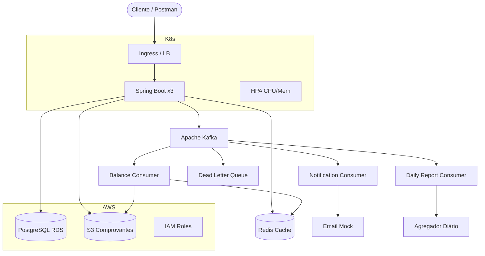
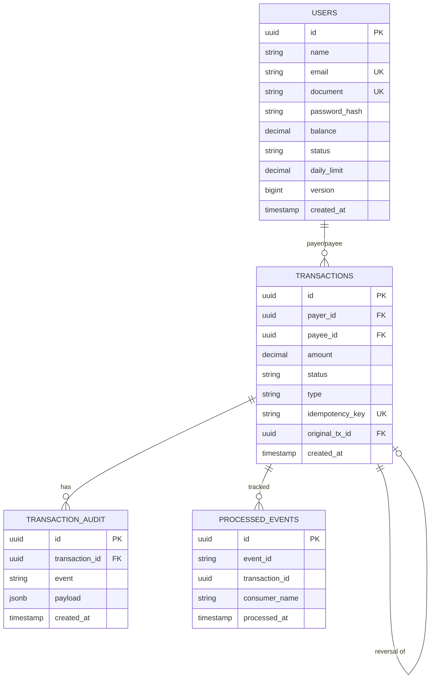
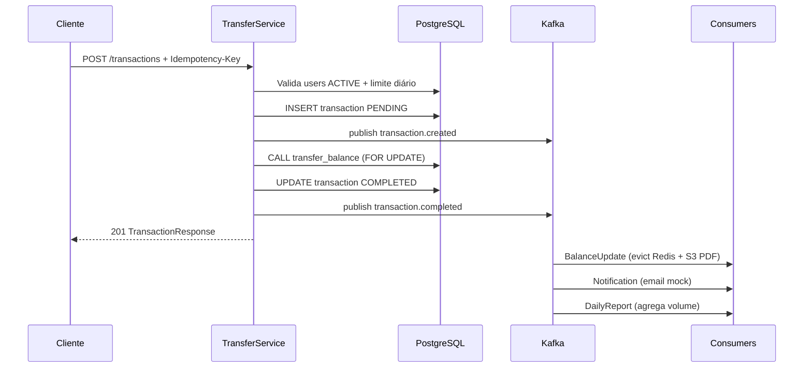

# Diagramas

## Arquitetura geral

```mermaid
flowchart TB
    Client([Cliente / Postman]) --> Ingress[Ingress / LB]
    Ingress --> API[Spring Boot x3]

    API --> PG[(PostgreSQL RDS)]
    API --> Redis[(Redis Cache)]
    API --> Kafka[Apache Kafka]
    API --> S3[(S3 Comprovantes)]

    Kafka --> C1[Balance Consumer]
    Kafka --> C2[Notification Consumer]
    Kafka --> C3[Daily Report Consumer]
    Kafka --> DLQ[Dead Letter Queue]

    C1 --> Redis
    C1 --> S3
    C2 --> Email[Email Mock]
    C3 --> Report[Agregador Diário]

    subgraph AWS
        PG
        S3
        IAM[IAM Roles]
    end

    subgraph K8s
        Ingress
        API
        HPA[HPA CPU/Mem]
    end
```

## Modelo de dados (DER)

```mermaid
erDiagram
    USERS ||--o{ TRANSACTIONS : "payer/payee"
    TRANSACTIONS ||--o{ TRANSACTION_AUDIT : has
    TRANSACTIONS ||--o| TRANSACTIONS : "reversal of"
    TRANSACTIONS ||--o{ PROCESSED_EVENTS : tracked

    USERS {
        uuid id PK
        string name
        string email UK
        string document UK
        string password_hash
        decimal balance
        string status
        decimal daily_limit
        bigint version
        timestamp created_at
    }

    TRANSACTIONS {
        uuid id PK
        uuid payer_id FK
        uuid payee_id FK
        decimal amount
        string status
        string type
        string idempotency_key UK
        uuid original_tx_id FK
        timestamp created_at
    }

    TRANSACTION_AUDIT {
        uuid id PK
        uuid transaction_id FK
        string event
        jsonb payload
        timestamp created_at
    }

    PROCESSED_EVENTS {
        uuid id PK
        string event_id
        uuid transaction_id
        string consumer_name
        timestamp processed_at
    }
```

## Fluxo da transferência

```mermaid
sequenceDiagram
    participant C as Cliente
    participant API as TransferService
    participant DB as PostgreSQL
    participant K as Kafka
    participant Cons as Consumers

    C->>API: POST /transactions + Idempotency-Key
    API->>DB: Valida users ACTIVE + limite diário
    API->>DB: INSERT transaction PENDING
    API->>K: publish transaction.created
    API->>DB: CALL transfer_balance (FOR UPDATE)
    API->>DB: UPDATE transaction COMPLETED
    API->>K: publish transaction.completed
    API-->>C: 201 TransactionResponse

    K->>Cons: BalanceUpdate (evict Redis + S3 PDF)
    K->>Cons: Notification (email mock)
    K->>Cons: DailyReport (agrega volume)
```
