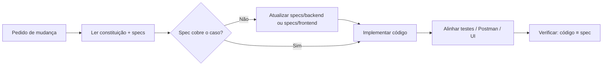

# Fluxo de Trabalho SDD

## Ciclo oficial

## Checklist antes de codar

- [ ] Li `specs/constitution.md`
- [ ] Identifiquei se o impacto é **backend**, **frontend** ou **ambos**
- [ ] Li a(s) spec(s) em `specs/backend/` e/ou `specs/frontend/`
- [ ] Se comportamento novo: editei a spec **antes** do código
- [ ] Escopo dentro do permitido (sem vibe coding)

## Checklist depois de codar

- [ ] Regras BR-* ainda válidas (`specs/backend/product/business-rules.md`)
- [ ] Contrato API / eventos / schema atualizados se mudaram
- [ ] Spec frontend atualizada se a UI mudou
- [ ] Sem lógica de negócio em controllers
- [ ] Testes cobrindo regra alterada

## Templates de mudança

### Nova regra de negócio (backend)
1. Adicionar `BR-XXX` em `backend/product/business-rules.md`
2. Implementar em `domain` + `application`
3. Teste unitário nomeado após a BR

### Novo endpoint (backend)
1. Documentar em `backend/api/rest-v1.md`
2. Controller fino + use case
3. Atualizar Postman
4. Se a UI consumir: atualizar `frontend/overview.md`

### Nova coluna/tabela (backend)
1. Atualizar `backend/data/schema.md`
2. Nova migração Flyway (nunca editar V1..Vn aplicados)

### Novo evento Kafka (backend)
1. Atualizar `backend/events/kafka.md`
2. Topic config + producer/consumer + idempotência

### Nova tela / fluxo UI (frontend)
1. Atualizar `frontend/overview.md`
2. Implementar em `web/`
3. Se precisar de API nova: atualizar `backend/api/rest-v1.md` **antes**

## O que NÃO fazer

- Pedir/gerar código sem ler specs
- Inventar endpoints, eventos ou entidades “úteis”
- Duplicar regras só no README sem refletir em `specs/`
- Colocar detalhes de UI em `specs/backend/` (ou regras de ledger em `specs/frontend/`)
- Tratar `DESAFIO.MD` como spec viva — o desafio é origem; **specs/** é a verdade operacional
